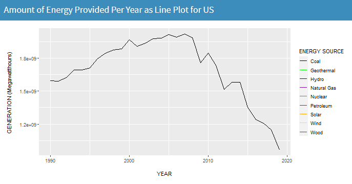
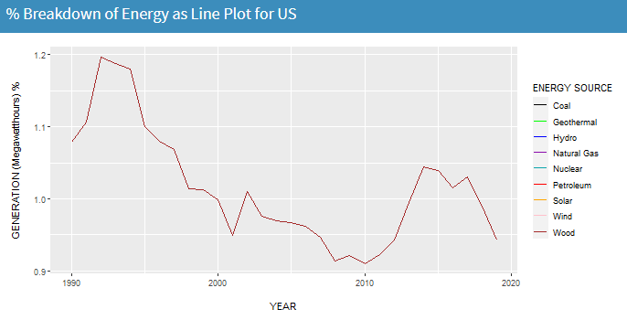

<html> 
  <head> 
  </head> 
  
  <body>
  <h5> App Link </h5> 
  <a href = "https://vivekb.shinyapps.io/Project1/"> Shiny Apps Project 1 Link </a> 
   
   
  

    <h3> Introduction and Description </h3> 
    
 Project 1 is a project focused on learning how to develop shiny app web applications for data manipulation and visualization. Some of the basic things covered within this app is learning how to import data, manipulate said data and then create a user interface for visualizing the data. 
 
    
     
    
   
  The project focuses on visualizing the energy that is used within the US and looking at the data over time. There is a focus on 9 resources overall: Coal, Hydro, Natural Gas, Petroleum, Wind, Wood, Nuclear, Geothermal, and Solar. 
 
   
     
   
   
 The first page displays the totals for the US and shows the 9 energies over time. The energy sources can be selected to give a more comprehensive idea. 
 
   
     
   <figure> 
     
  <figcaption> A picture of the first tab that shows the US data charts </figcaption> 
  </figure> 
   
     
   
   
 The second page allows the user to interact with two different regions and they are allowed to choose energy sources to compare between. They are able to select the same location and compare the same source over time or different sources in the same time frame for instance. The user is also able to select two different energy sources, two different time periods, and two different locations for comparison. The data displayed shows box plots for change in time as well as contribution. There are line plots for growth over time and raw data for comparison as well. 
 
     
   
   <figure> 
     
  <figcaption> A picture of the second tab that shows the state to state comparison data charts </figcaption> 
  </figure> 
     
   
 Finally the user is allowed to compare two different energy sources and two different time periods looking at the US holistically.   

      
    
    <figure> 
       
      <figcaption> A picture of the third tab that shows the energy over time for the US data charts </figcaption> 
    </figure> 

   
  
 There is an about page on the fourth tab. 
 
  

  
   
   
  
  
 
  <h3> Data Processing </h3> 
  
 
  The data was collected from the US Energy Information Administration. The dataset was the net generation of energy organized by State and Type of Producer over time. 
  
 
   
  <figure> 
     
  <figcaption> A picture of the that shows the commands done to the dataset in R to clean the data</figcaption> 
  </figure> 
   
  
 
    The initial data manipulation done to the dataset involved cleaning up the dataset such that it was easier to handle and more focused on the information trying to be collected.
  
 
    
  
 
    The first steps in cleaning up the data involved converting the dataset to the proper format. In this case certain features such as the GENERATION column was read in as string where in actuality it was a numeric value used to measure the production amount for the data. The other columns were converted to be more friendly values by converting them to factors. 

 

  

 
  The second step involved missing data and incorrectly labeled data. There was a lack of uniformity in the data specifically with the STATE column. There was an issue with the labeling of data pertaining to the US overall data. Some tuples were labeled with “US-TOTAL” in all caps. There was another case that was mixed cased “US-Total” which needed to be converted to the same uniform value. The issue with the missing data also stemmed from the STATE column where there NA values present in the column that needed to be corrected. 
  
 
    
  
 
  The final measure that was taken was the most important one: selecting what data to look at and keep. The project strived to look at Coal, Hydro, Natural Gas, Petroleum, Wind, Wood, Nuclear, Geothermal, and Solar forms of energy; so other types needed to be removed. 
    
 
  
 
  
    
    
  
  

  <h3> Instructions to operate </h3>  
  <a href="https://github.com/Vivek2018/Project1-CS424"> Github Project Repo </a> 
  
 
    To run this project there are a few requirements:   
    1) Correct libraries and proper library versions
    2) Downloading the repo and opening the R project to start an R-Studio session
    3) Correct dataset from https://www.eia.gov/electricity/data/state/
  

    
  
 These instructions are enough to get the project working, however to make sure everything is compatable it is assumed that you have R-Studio and Shiny Apps already installed. Otherwise the user will need to install said software beforehand. There are a lot of libraries involved within the project so it is best to have everything up to date with this project.  

The libraries include:   
library(shiny)   
library(readr)  
library(ggplot2)  
library(shinydashboard)  
library(DT)  
library(dplyr)  
library(rlang)  
library(maps)  
library(mapdata)  
library(maptools)  
library(ggthemes)  
library(rgeos)  
library(ggmap)  
library(sp)  
library(stringr)  
library(plyr)  
  

  

  
    
    
  
  
 
  <h3> Interesting Features </h3> 
  
 
    The data showed interesting trends in terms of the growth in energy and specific usages of energy. Historical technological growth and environmental preservation motivations are easily seen in the data. Another thing that can be seen is the lack of natural resources and drop in their usage overtime. 
    
 
  
  
 
    The biggest and most noticeable trend is the growth in technology in the last 30 years. The general trend in all of the data is the growth of the contribution of each energy source. This can explained through more efficient ways to harvest the resources and more efficient ways to produce/convert energy from the source. 
  
 
  <figure> 
     
  <figcaption> A picture displaying the overall growth in the energy over time </figcaption> 
  </figure> 
  
 
    There is a drop off in some energy sources that can be explained with an increase in other more green technologies. With a larger focus on remaining environmental friendly some energy sources have been utilized more and other energy sources are dropping off.
  
 
    
  
 
    For instance when looking at energy sources such as wood and coal that require rare resources from the planet and are consumed very easily, we can see the energy usages for both level off.
  
 
    
  
  
  <figure> 
     
  <figcaption> A picture of the coal data demonstrating the drop off in usage and production </figcaption> 
  </figure> 
   
  <figure> 
     
  <figcaption> A picture of the coal data demonstrating the drop off in usage and production </figcaption> 
  </figure> 
   
   
  
 
    In contrast energies like solar, hydro, and wind sky rocket in usage in the more recent years to compensate for energy production. 
  

    
  <figure> 
     
  <figcaption> A picture of green energy source data demonstrating the increase in usage and production </figcaption> 
  </figure> 
  
 
   
   
  
 
  <h3> Youtube Video </h3> 
  

  </body>
 </html>
