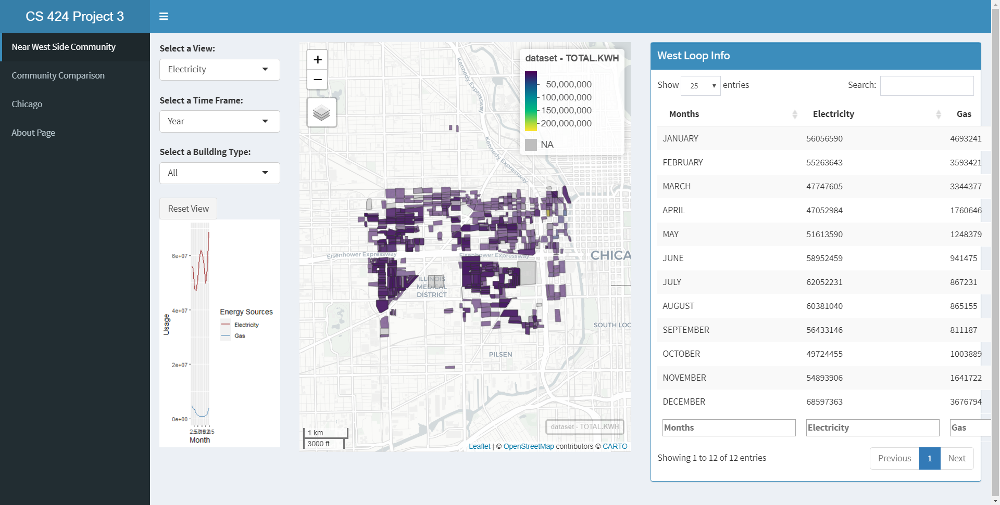
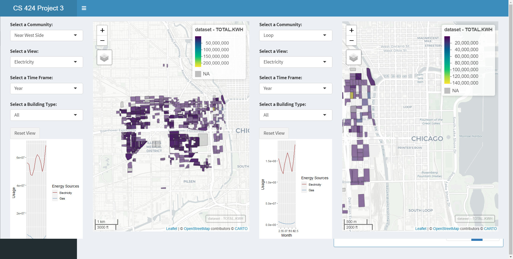
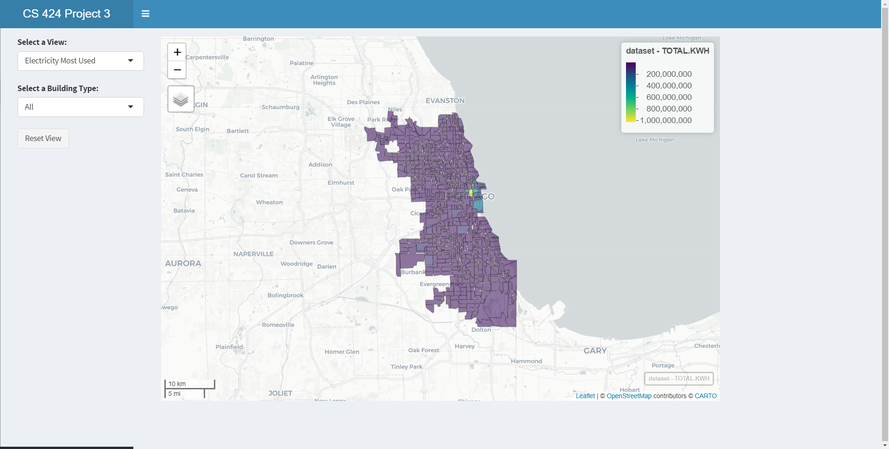
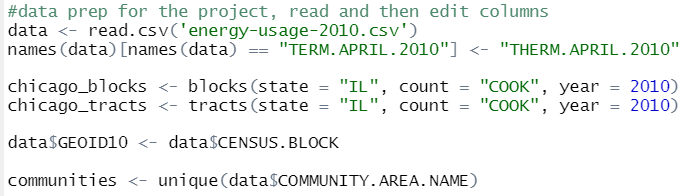
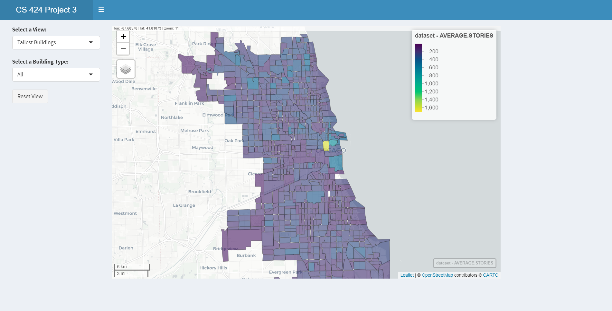
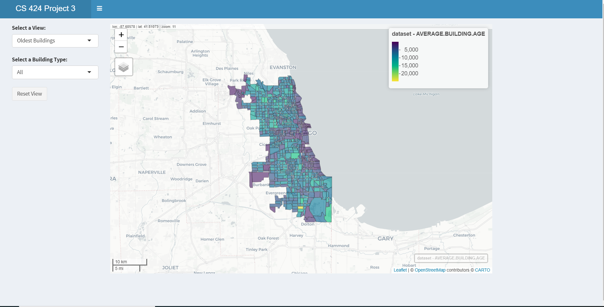
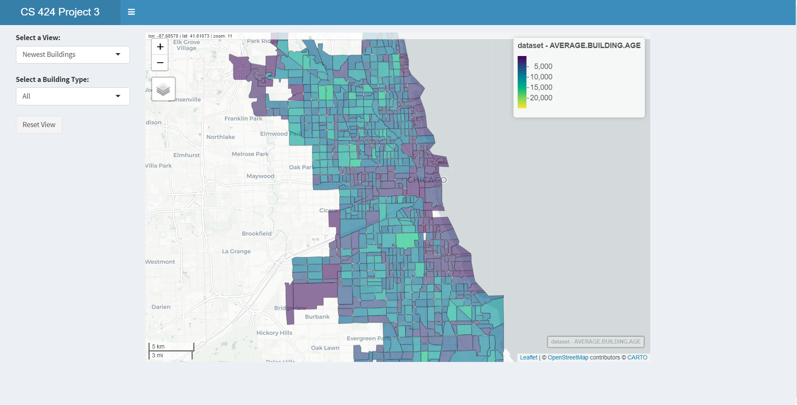

<html> 
  <head> 
  </head> 
  
  <body>
  <h5> App Link </h5> 
  <a href = "https://vivekb.shinyapps.io/Project3/"> Shiny Apps Project 3 Link (Was not uploaded to shiny apps this time)</a> 
   
   
  

    <h3> Introduction and Description </h3> 
    
 Project 3 is a project focused on learning how to develop shiny app web applications for data manipulation and visualization. However, Project 3 adds onto the concepts covered in Project 2 and adds more complex graphing capabilities especially when it comes to maps. Some of the things covered within this app is learning how to import data, manipulate said data and then create a user interface for visualizing the data with mapview maps. 
 
    
     
    
   
  The project focuses on visualizing the energy usage and other demographics for chicago looking at the data for 2010 per block and tract regionally. There is a focus on 2 resources overall: Electricity and Gas. Other demographics pertain to population factors and to the buildings themselves: population, total population, renter population, building stories, and building age. 
 
   
     
   
   
 The first page displays the demographics for the Near West Loop within Chicago in the year 2010 and allows the user to toggle through the selection options to see the information per block. 
 
   
     
   <figure> 
     
  <figcaption> A picture of the first tab that shows the Near West Loop Blocks  </figcaption> 
  </figure>  
   
     
   
   
 The second page allows the user to interact with two different communities and the user is allowed to choose energy sources and other demographics to compare between the two. They are able to select the same location and compare the different information or different sources for instance. The user is also able to select multiple different energy sources, multiple demographics, and two different locations for comparison. The data displayed shows mapview plots for blocks in 2010 per the 77 communities in chicago. The mpaview plot allows for the user to see the actual contribution of each block by hovering over and clicking each block and seeing the visual size of each block contribution. 
 
     
   
   <figure> 
     
  <figcaption> A picture of the second tab that shows the community to community comparison data charts </figcaption> 
  </figure> 
     
   
 Finally the user is able to see all the previous information based off the tracts within chicago.   

      
    
    <figure> 
       
      <figcaption> A picture of the third tab that shows the tracts for chicago </figcaption> 
    </figure> 

   
  
 There is an about page on the fourth tab. 
 
  

  
   
   
  
  
 
  <h3> Data Processing </h3> 
  
 
  The data was collected from the Chicago census data center. The dataset was the demogrpahics organized by block and tracts for all of illinois but was filtered to contain chicago only. There were issues with inconsisten data that needed to be all corrected to the same degree to make the data usable.
  
 
   
  <figure> 
     
  <figcaption> A picture of the that shows the commands done to the dataset in R to clean the data</figcaption> 
  </figure> 
   
  
 
    The initial data manipulation done to the dataset involved cleaning up the dataset such that it was easier to handle and more focused on the information trying to be collected.
  
 
    
  
 
    The first steps in cleaning up the data involved converting the dataset to the proper format. Keeping the file as a shapefile was the most difficult part in keeping everything working together. Another thing that had to be done was keep track of the column names for any gas related columns because they were inconsistently named. They had to be adjusted to the same one either "THERM" or "THERMS" and in some case "TERM" had to be corrected. 

 

  

 
  The second step involved missing data and incorrectly labeled data. There was a lot of missing data that needed to be filled in or dropped from certain columns because they could cause the plot to brake otherwise. 
  
 
    
  
 
  The final step was to continually merge the data with coordinates shape file and the information provided by the data file and merge by the GEOID. 
    
 
  
 
  
    
    
  
  

  <h3> Instructions to operate </h3>  
  <a href="https://github.com/Vivek2018/CS424Project3"> Github Project Repo </a> 
  
 
    To run this project there are a few requirements:   
    1) Correct libraries and proper library versions
    2) Downloading the repo and opening the R project to start an R-Studio session
    3) The data file is included with the repo so you can download the repo only and you would be okay
  

    
  
 These instructions are enough to get the project working, however to make sure everything is compatable it is assumed that you have R-Studio and Shiny Apps already installed. Otherwise the user will need to install said software beforehand. There are a lot of libraries involved within the project so it is best to have everything up to date with this project.  

The libraries include:   
library(ggplot2)  
library(shiny)  
library(mapview)  
library(shinydashboard)  
library(leaflet)  
library(hash)  
library(tigris)  
library(dplyr)   
  

  

  
    
    
  
  
 
  <h3> Interesting Features </h3> 
  
 
    The data showed interesting trends in terms of the growth in energy and specific usages of energy. Comparing information over time based off the regions of chicago that were built more recently vs. buildings that were built a long time ago. You can see the disparity between each community within chicago. 
    
 
  
  
 
    Aside from the modernization of chicago you can also see the economic situations of each community and the clustering of people in chicago.
  
 
  <figure> 
     
  <figcaption> A picture displaying the modernization of chicago </figcaption> 
  </figure> 
  
 
    As you proceed to the hub of chicago with all the skyscrapers the height increases there exceptionally. As you proceed outwards from there you will see that the heights decrease and you can see how chicago modernized from that central point. 
  
 
    
  
 
    Another thing to look at to support that theory is the changes in the building age as you move from that area outward.
  
 
    
  
  
  <figure> 
     
  <figcaption> A picture of the old tract in chicago </figcaption> 
  </figure> 
   
  <figure> 
     
  <figcaption> A picture of the newest buildings in chicago </figcaption> 
  </figure> 
   
   
  
 
    The newest buildings are colored in a dark purple in the newest picture where as the colors in the oldest one go from purple (old) to yellow which is really old. You can see the newest buildings are throughout chicago but focused around the tallest buildings and the buildings that are the oldest are focused away from that hub. 
  

    
  
 
   
   
  
 
  <h3> Youtube Video </h3> 
  <a href="https://youtu.be/SrkgOrCIs_Y"> Youtube Video Link </a> 
   
   
  <iframe width="420" height="345" src="https://www.youtube.com/embed/SrkgOrCIs_Y">
  </iframe>
  

  </body>
 </html>
