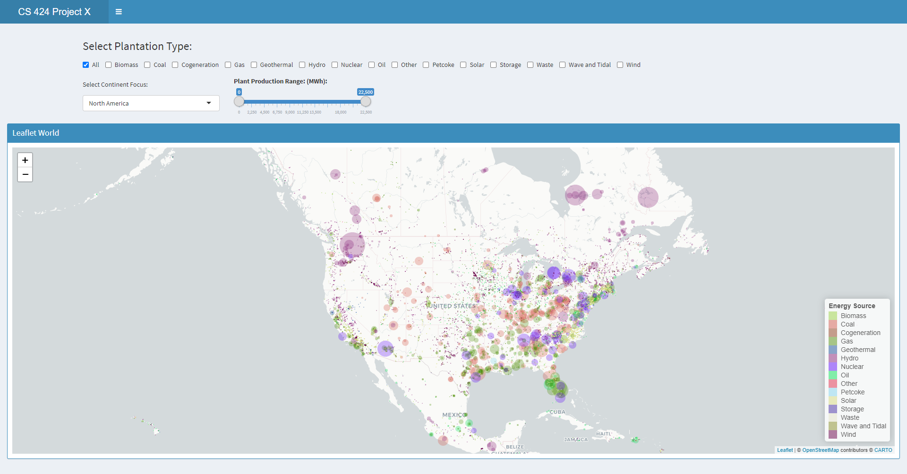
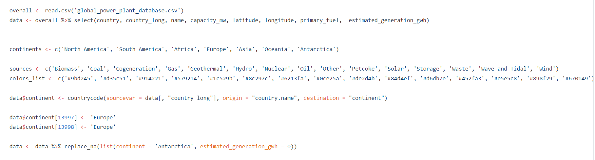
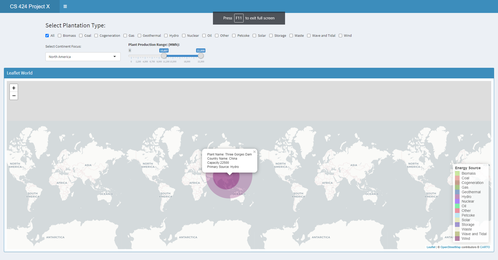
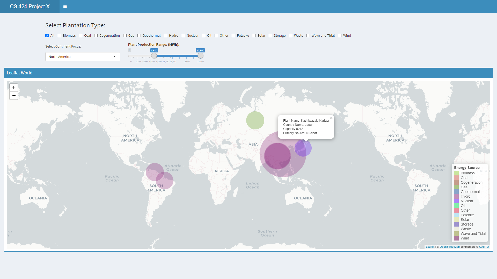
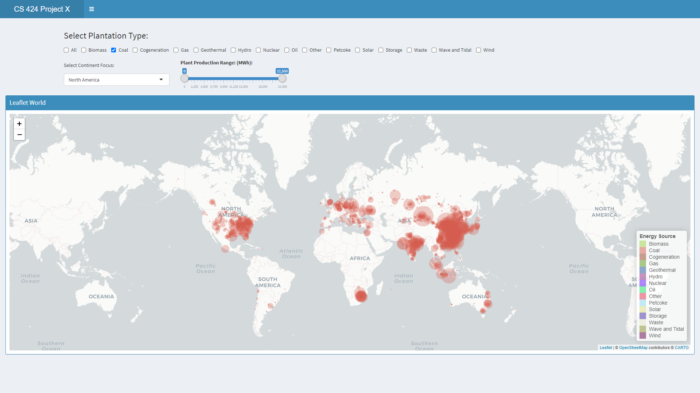
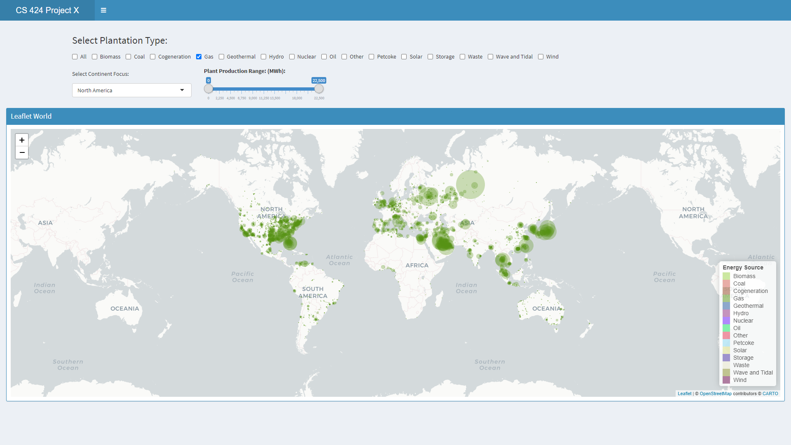
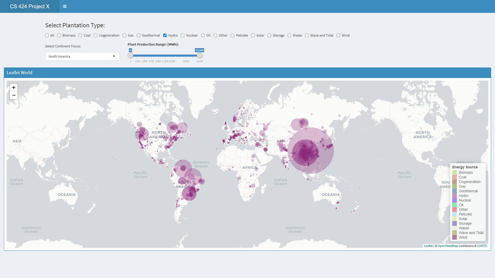
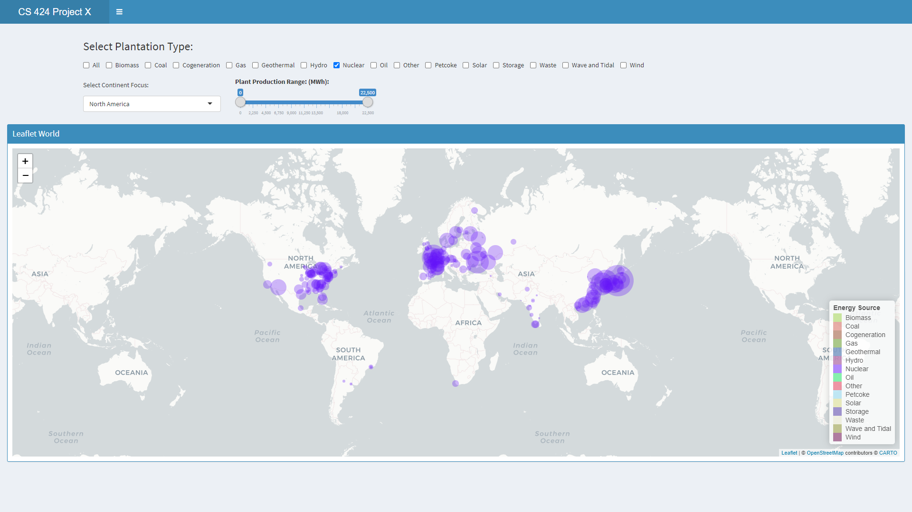

<html> 
  <head> 
  </head> 
  
  <body>
  <h5> App Link </h5> 
  <a href = "https://vivekb.shinyapps.io/ProjectX/"> Shiny Apps Project X Link </a> 
   
   
  

    <h3> Introduction and Description </h3> 
    
 Project X is a project focused on learning how to develop shiny app web applications for data manipulation and visualization. However, Project X adds onto the concepts covered in Project 2 and Project3. Project X adds more complex graphing capabilities especially when it comes to maps. Some of the things covered within this app is learning how to import data, manipulate said data and then create a user interface for visualizing the data with leaflet maps. 
 
    
     
    
   
  The project focuses on visualizing the energy that is used around the world and looking at the data over by region and production values. There is a focus on 15 resources overall: Coal, Hydro, Natural Gas, Oil, Wind, Biomass, Nuclear, Geothermal, Solar, Other, Waves and Tidal, Cogeneration, Petcoke. Storage, Waste. 
 
   
     
   
   
 The first page displays the power plantations around the world in the year 2019 and allows the user to toggle through the energies and see which plantations are more abundent and where they are located. 
 
   
     
   <figure> 
     
  <figcaption> A picture of the first tab that shows the Magellan Map and resources  </figcaption> 
  </figure>  
   
     
   
   

   The graph is manipulatable and demonstrates a legend for each of the 15 unique sources. The graph allows the user to pan and see procedurally generated information. The map has a drop down to change the focus of the map onto a particular continent. The map can be adjusted by the generation output and the type of resource that you want to examine. Clicking on the type allows the user to see all plantations of that type around the world. The resource selection is able to select multiple resources. 
   

   
   
  
 There is an about page on the second tab. 
 
  

  
   
   
  
  
 
  <h3> Data Processing </h3> 
  
 
  The data was collected from the Global Power Plant Database featured at <a href = "datasets.wri.org"> datasets.wri.org </a>. The dataset details the information based off columns for each plantation. Each plantation is listed by the country code, country name, plantation name, plantation owner, location, production type, and production amount, followed by other background information such as development period, etc. 
  
 
   
  <figure> 
     
  <figcaption> A picture of the that shows the commands done to the dataset in R to clean the data</figcaption> 
  </figure> 
   
  
 
    The initial data manipulation done to the dataset involved cleaning up the dataset such that it was easier to handle and more focused on the information trying to be collected.
  
 
    
  
 
    The first steps in cleaning up the data involved converting the dataset to the proper format. Converting numeric values from character to numeric was one of the first steps taken. The next thing to do was get the continent associated with each plantation based off the country code. There was some mislabels with countries like Kosovo. This was manually handled. 

 

  

 
  Aside from that there weren't any other changes made to the dataset.
  
 
    
  
  
 
  
    
    
  
  

  <h3> Instructions to operate </h3>  
  <a href="https://github.com/Vivek2018/CS424ProjectX"> Github Project Repo </a> 
  
 
    To run this project there are a few requirements:   
    1) Correct libraries and proper library versions
    2) Downloading the repo and opening the R project to start an R-Studio session
    3) Going to https://datasets.wri.org/dataset/globalpowerplantdatabase
    4) Downloading the data for 2019
  

    
  
 These instructions are enough to get the project working, however to make sure everything is compatable it is assumed that you have R-Studio and Shiny Apps already installed. Otherwise the user will need to install said software beforehand. There are a lot of libraries involved within the project so it is best to have everything up to date with this project.  

The libraries include:   
library(shinydashboard)   
library(shiny)   
library(leaflet)   
library(tidyverse)   
library(hash)   
library(countrycode)   

  

  

  
    
    
  
  
 
  <h3> Interesting Features </h3> 
  
 
    The data was an interesting analysis of what countries relied on and what the world relied on primarily for data generation. 
    
 
  
  
 
    The most notable trends were focused around which country had the largest power plants and of what type they were. The initial assumption is that nuclear would be the largest generation source considering it powers somewhere from 10%-25% of the world's total power consumption. However when looking at the results from the 2019 the largest power plantations are from Hydro plantations based in China. 
  
 
  <figure> 
     
  <figcaption> A picture displaying the largest plantations </figcaption> 
  </figure> 
  
 
    This result was based off by scaling the capacity of generation to about the upper half and there are only two plantations up in that fold. Both plantations are based in China and it seems the 3rd place ranked plantation is based on Gas in Russia but then again is overtaken by Hydro in South America. 
  
 
    

<figure> 
     
  <figcaption> A picture displaying the largest plantations with expanded filters</figcaption> 
  </figure> 
  

  
 
    The basic conjecture looking at this is that Hydro is the largest producer for the world based off only the largest plantations. Looking at all plantations combined however and summing up their individual parts. 
  
 
    
  
  
 If we do a cross comparison between all the types of resources that we know are the most heavily contributing: Coal, Gas, Hydro, and Nuclear we can compare the overall number and size to get an estimate on the number one contributing source around the world. 

  <figure> 
     
  <figcaption> A picture of the coal data around the world</figcaption> 
  </figure> 
   

  <figure> 
     
  <figcaption> A picture of the coal data around the world</figcaption> 
  </figure> 
   

  <figure> 
     
  <figcaption> A picture of the coal data around the world</figcaption> 
  </figure> 
   

  <figure> 
     
  <figcaption> A picture of the coal data around the world</figcaption> 
  </figure> 
   
  
   
   
  
 
    Examining the results from the pictures it looks like a tie between coal and hydro. Both have numerous clusters but hydro definitely has the larger clusters but maybe not as frequent throughout the globe.
  

    

  
 
   
   
  
 
  <h3> Youtube Video </h3> 
  <a href="https://youtu.be/Rp689LJQxmU"> Youtube Video Link </a> 
   
   
  <iframe width="420" height="345" src="https://www.youtube.com/embed/Rp689LJQxmU">
  </iframe>
  

  </body>
 </html>
