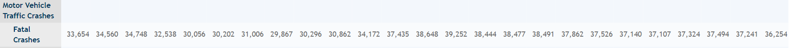

<html> 
  <head> 
  </head> 
  
  <body>
  <h5> Visualization Link </h5> 
  <a href = "https://icsw.nhtsa.gov/nhtsa/fars/speeding_data_visualization/"> Speeding Data Visualization </a> 
   
   
  

    <h3> What is its purpose? </h3> 
    
 The visualization is a visualization depicting the number of car crashes that occured in 2016 due to speeding. The car crashes focus around fatalities and how car crashes related to speeding contribute to the fatality number for the US. There are other factors to determine the specific factors related to the crashes such as who died in the crash, month filters, and day and time filters. This all allows the user to narrow down when speeding related crashes occur and see the percent of crashes that are related to the those specific parameters. All in all, the visualization makes it easier to grasp the contribution of speeding related deaths in the total sum of all traffic fatalities in the nation. 
 
    
     
   

    <figure> 
     
  <figcaption> A map of the US depicting the speeding fatalities to all fatalities  </figcaption> 
  </figure>  

    

    

    <h3> What is the data? </h3>
   
   
    The data is a nationwide census provided by NHTSA, Congress, and American public data. The data focuses on the fatal injuries suffered from motor vehicle traffic crashes. The data covers a span of years from 1994-2018 and contains the following information: 
     
     
     
    Motor Vehicle Traffic Crashes:  
        Fatal Crashes
     
     
     
    

    <figure>
    
    <figcaption> Figure showing the first subsection within the dataset </figcaption>
    </figure>

     
    

    Traffic Crash Fatalities:    
        Vehicle Occupants:  
        Drivers,  
        Passengers,  
        Unknown,  
        Sub Total1,  
        Motorcyclists 
         
          
        Nonmotorists:  
        Pedestrians,  
        Pedalcyclists,  
        Other/Unknown,  
        Sub Total2    
        Total      
    

    <figure>
    
    <figcaption> Figure showing the second subsection within the dataset </figcaption>
    </figure>

     

    

    Other National Statistics:      
        Vehicle Miles Traveled (Billions),  
        Resident Population (Thousands),  
        Registered Vehicles (Thousands),  
        Licensed Drivers (Thousands)      
    

    <figure>
    
    <figcaption> Figure showing the third subsection within the dataset </figcaption>
    </figure>
    
     

    

    National Rates:    
        Fatalities:  
        Fatalities per 100 Million Vehicle Miles Traveled,       
        Fatalities per 100,000 Population,  
        Fatalities per 100,000 Registered Vehicles,  
        Fatalities per 100,000 Licensed Drivers	 
    
    

    
     

    <figure>
    
    <figcaption> Figure showing the fourth subsection within the dataset </figcaption>
    </figure>

     
     
     

    <figure>
    
    <figcaption> Full dataset </figcaption>
    </figure>

    
 As per the dataset it is evident that it is an amalgamation of all traffic accidents in the US between the years of 1994-2018 and gives a breakdown of accidents per type of party involved along with other traffic data. The year 2016 was specified and speeding was specified for the actual visualization. 

   
     
    
   

   
  
 
  <h3> How was the data collected?</h3> 
  
 
    As mentioned in the above section the data was collected from a nationwide census providing NHTSA, Congress and the American public yearly data regarding fatal injuries suffered in motor vehicle traffic crashes. The data from all the sources are combined and pooled into one big dataset which is drawn from to create the visualization. There are other datasets compiled from the original megasource to make it easier to parse the data and get the filters but overall the dataset is compiled by the columns mentioned above and by year along with the filters that are used to narrow down user search results on the viusalization. 
  
 
   
    <a href = "https://www.nhtsa.gov/node/97996/251"> Link to data download for all years</a>
   

     
  <figure> 
     
  <figcaption> Picture illustrates the multiple configurations and amalgamations of the data  </figcaption> 
  </figure> 
   
   

  
 
    The subsidiary dataset provides additional data in reference to time and date and combines with the numeric data to create more holistic dataset to be used for the visualization and categorize data better than just having the numeric data to analyze in the visualization. 
  
 
     
     
  <figure> 
     
  <figcaption> Picture illustrates all the data options that are there  </figcaption> 
  </figure> 

    
   
  
  

  <h3> Who are the users that this visualization was made for? </h3>  
  
 
    The target audience is a bit varied and it seems this data is geared towards government officials who need the data to get a better understanding of traffic accidents and what effects play into those traffic fatalities. The visualization itself focuses on speeding and the correlation between speeding and fatalities and speeding fatalities with the overall fatalities. In this case the focus is on demographical data of speeding fatalities and how to mitigate those depending on certain factors such as time of day, when in the month, and when in the year. Is there a particular increase in winter for instance. The visualization is available to everyone who wants to view it online on the <a href = "https://icsw.nhtsa.gov/nhtsa/fars/speeding_data_visualization/"> nhtsa.gov website </a>.    The target users might be tailored to government officials and road safety and traffic guideline related individuals, but allowing it to be online allows for a lot more users to view and make use of the visualization for private studies.  
  

  
    
  
  

  
    
    
  
  
 
  <h3> What questions do people want to ask? </h3> 
  
 
    Some of the most basic questions that come to mind when looking at the visualization are:  
     
    "What are the percentage of speeding accidents in comparison to the total number of accidents total for that state?"
     
    "Where do the majority of crashes occur in the whole country?"
     
    "Are the occupants dying more or the passengers/pedestrians being killed more?"
     
    "What time of day and when in the scope of a year are people getting into speeding accidents?"
     
    "Which states have the highest percentage of speeding accidents in comparison to all traffic accidents?"
     
    "Conversely, what states have the lowest percentage of speeding accidents in comparison to to all traffic accidents?"
     
    "Where do speeding accidents mainly occur? On interstate highways or local roads for examples?"
    
 
    

     
     
    

    <h3> Answering questions with the visualization </h3>
    

       The visualization has many little details that provide a lot of information that can be used to answer questions about traffic accidents. To answer the questions mentioned above:   

    "What are the percentage of speeding accidents in comparison to the total number of accidents total for that state?"
      
    The default option on the map displays percentages and makes use of colors and color depth to indicate high and low values. Hovering over a state is fluid and gives more details on the percentage value and specific details and numbers necessary to provide good information.
    

<figure> 
 
  <figcaption> Picture illustrates the data for all the states and one particular state by hovering over it  </figcaption> 
  </figure>
     
     
    Clicking on a state gives all the information in more detail for the state. 
     
     
    <figure> 
 
  <figcaption> Picture illustrates the data for one particular state  </figcaption> 
  </figure>
      
     
    

    "Where do the majority of crashes occur in the whole country?"
     
     
    This is tied to the question above. The map allows two views: STATE and CRASHES. Selecting the crashes creates a representation of clusters of crashes on the maps. Each clusters is a crash and shows the particular information of that crash such as: county and state, number of fatatlities and involved persons. Other data included is time of day and date and on what type of road the accident occurred on. All these details are helpful to show crashes and the spread of individual crashes across the nation. 
    

    <figure> 
 
  <figcaption> Picture illustrates the data for all crashes across the nation  </figcaption> 
  </figure>

    <figure> 
 
  <figcaption> Picture illustrates hover feature and selection feature of an individual crash  </figcaption> 
  </figure>
   
   
    

    "Are the occupants dying more or the passengers/pedestrians being killed more?"
      
    This is answered with the filtering system on the left hand side of the screen. The filter allows for selecting crashes involved with Occupants and Non-Occupants. The filter only includes crashes where the party selected passed away within the crash. By default the occupants are selected. You can remove all parties, select one party, or select all parties. 
    

     
    

    "What time of day and when in the scope of a year are people getting into speeding accidents?"
     
     
    All that information can be found out using the filters on the side. The filters allow for specific times to be selected and filtered. For instance you can select a specific month/months. You are also able to choose a day of the week and a specific hour within the day. All these options allow for multiple selections so you can have multiple hours selected and multiple days selected as well. These give you many combinations and allow you to create a subset of data for analysis.  
    

    

     
     
    "Which states have the highest percentage of speeding accidents in comparison to all traffic accidents?"
     
     
    "Conversely, what states have the lowest percentage of speeding accidents in comparison to to all traffic accidents?"
     
      
    Both the questions above can be answered by looking at the bar chart at the bottom of the page that sorts the data state information by percentage with the highest percentages towards the left and the smaller percentages towards the right. This creates a descending ladder and allows the user to hover over each section for a better idea and gain more information aside from which states have a high percentage and low percentage for speeding accidents.  

    "Where do speeding accidents mainly occur? On interstate highways or local roads for examples?"
    The bottom right of the visualization shows the speeding-related fatalities based off the road types. The filters and selection of particular states apply to the visualization across the board so it is easy to narrow that information down and figure out what road types you want depending on your filter choice. The roadtypes are ordered by number of incidents and how much they contributed to fatalities on that road type.  
   

   
   
   

    

    <h3> What works? </h3> 
     
    
 
        The visualization is very successful in displaying information and conveying it in an easy manner to the viewer. 
        The information is displayed very easily and the incorporation of colors and shading makes it easy to understand and comprehend. The shading aspect to the color scheme is a good idea since if people are color-blind and can't see shades of red they can still understand the diagram by the shading alone. The color choice is also good because it is easy on the eyes and isn't too bright so that it stands out and hurts the eyes to look at.
         
         
        The data is presented in a simple fashion and using numeric percents per state allows the viewer to easily comprehend the attributed values. The toggle feature for the crashes vs states is also nice because it gives a different perspective to the dataset and gives information about each particular crash rather than just state data. The hover feature over all the elements in the visualization is a key factor for convenience and understanding. The hover text gives more information and more details that are informative and helpful. The hover text applies to the bar graph and other elements such as the filters to provide helpful information about how to use the visualization. 
         
         
        The state bar chart being ordered by highest to lowest percentage of speeding fatalities is a nice feature as it allows for the user to quickly understand and navigate which states are at the highest and lowest points without having to manually search the US map to identify which states belong in which group and how an individual state compares across all the other states. The filter system based on an entry from the map is nice as it allows the user to select a particular state or crash to focus on and get more information. 
          
        The filters are nice as well since they are color coded by the same depth measure that is universally used across the visualization. This automatically indicates which filters have a large correspondence to the dataset. The filters grey out the filters that are not selected and that is a nice visual touch for better comprehension. 
    

    
  
     
     

    

    <h3> What needs improvement? </h3>
    

        The visualization has some minor problems when it comes to the choices made behind the filters and visuals. The first glaring thing is the load times on the visualization and how it hangs before computing the response and from experiments it can be anywhere from 20 seconds to over 30 seconds if it hasn't crashed.  

         
         

        The filter selection is okay when selecting a filter it is fine but adding additional filters and unselecting individual filters is bad because the visualization doesn't respond sometimes but the main issue is that it doesn't remove the selected fitler or add the new filter a lot of the times. Better choices could have been made to identify and keep track of which filters are active and in use. The use of the remove all filters is nice but again does not resolve the case of turning off individual filters. 

         
         
        The last issue with the visualization is the roadway information which is unsorted and is not so clear in what it is trying to display. The roads are tagged with a number and a color and the numbers and colors are out of order. If they were ordered by one specific format or if it could be adjusted that would be useful. The number on the left and the color are confusing as they are not straight forward and an improvement to the readibility would be good there. If they focused on the color and organized by that / percentage value like the states that would be good and the number could indicate the number of speeding accidents followed by the total speeding accidents on that type of road instead of just a number. 
    

    

  
 
  <h3> Youtube Video </h3> 
  <a href="https://www.youtube.com/watch?v=YvOq4Kzu2Ow"> Youtube Video Link </a> 
   
   
  <iframe width="420" height="345" src="https://www.youtube.com/embed/YvOq4Kzu2Ow">
  </iframe>
  

  
  </body>
 </html>
